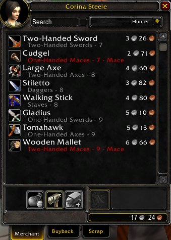
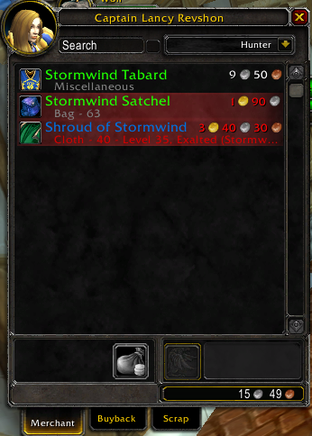
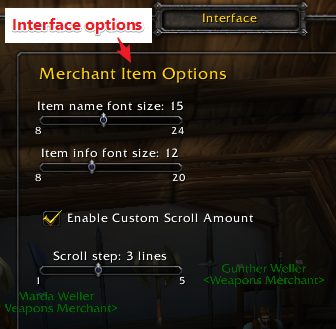
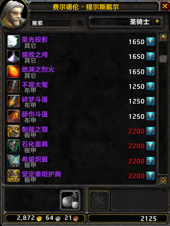
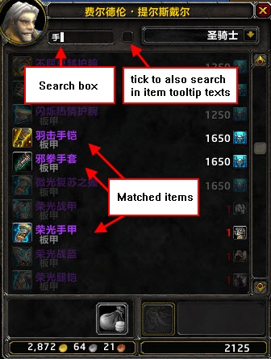
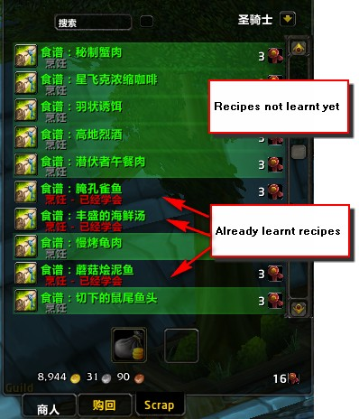

# xmerchant-wow-addon
Improved Vendor-Interface Addon for World of Warcraft

## CATEGORY
Auction & Economy

# README
README on github:   https://github.com/doneykoo/xmerchant-wow-addon/blob/main/README.md  
Curseforge page:    https://www.curseforge.com/wow/addons/xmerchant  
Former releases:    https://www.curseforge.com/wow/addons/xmerchant/files  

# FEATURES

xMerchant improves the Vendor-Interface into an easy and clearly arranged scrollable list.

* scrollable list, with all selling items.
* search function, supports inner text of item description.
    * Example: You search items with spell power, then write "spell power" and the list show the relevant items.
* error notice
    * Example: item require a specific level, or profession, or faction, etc..., are clearly marked.
* coloring
    * Example: Items which you can't use, will be marked in red and the cause why you can't use this, is displayed.
    * Example: Recipes, that you have not yet learned, are marked green.

But a picture is better than words: See picture :-)

## [German]
xMerchant verbessert das Händler-Interface in ein einfaches und übersichtliches Scroll-Fenster. Desweiteren wird eine Suchfunktion hinzugefügt. Sucht man (als Beispiel) Gegenstände die Zaubermacht haben, so gibt man 'Zaubermacht' ein und erhält genau diese.

• Gegenstände, die man nicht benutzen kann, werden rot markiert und es steht direkt dran, wieso man sie nicht benutzen kann. • Rezepte, die man nicht gelernt hat, werden grün markiert und Rezepte die man bereits erlernt hat, sind unmarkiert. (Auf mehrfachen Wunsch)

Bilder sagen mehr als 1000 Worte. Siehe Bild. :-)

# More Showcases

# LICENSE

**xMerchant** (World of Warcraft Addon) Copyright (c) 2010-2012, Nils Ruesch(me#shantalya#de) All rights reserved.

The original author: *Nils Ruesch(me#shantalya#de)* has authorized *doneykoo(doneykoo#gmail#com)* to setup and manage this project on Curse.

# COMMENT

doneykoo:
xMerchant has revived! This is a great addon, which has brilliant convenient features.
As granted by author Nils Ruesch, I'll maintain this project and fix possible bugs for future versions.

# TO REPORT A BUG / DEFECT

Use github issues: https://github.com/doneykoo/xmerchant-wow-addon/issues

